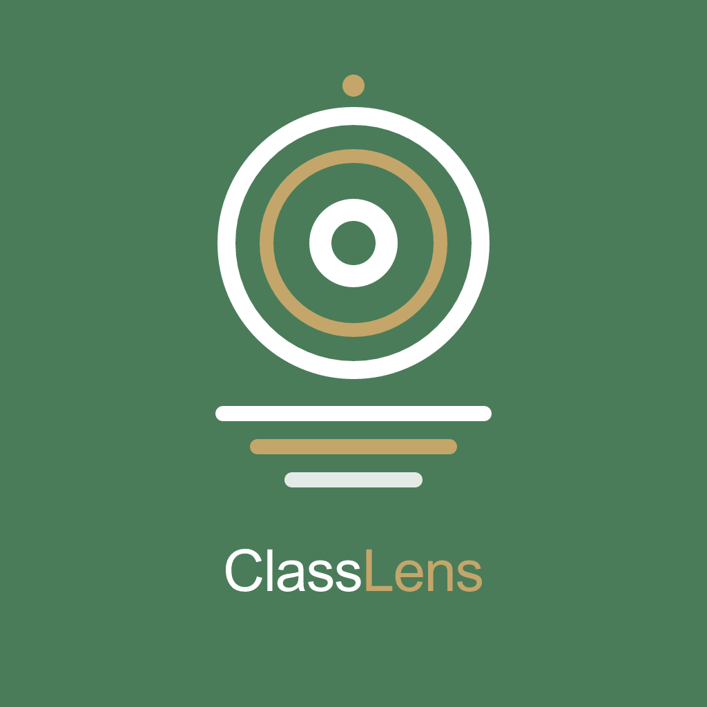

<p align="center">
  
</p>

<h1 align="center">ClassLens</h1>

<p align="center">
  <strong>Capture the lecture. Keep the knowledge.</strong>
</p>

<p align="center">
  
  
  
  
  
  
</p>

---

ClassLens is an intelligent mobile notebook for college students. It turns photos of lecture slides, whiteboards, and handwritten notes into organized course material that students can review, search, ask questions about, and use to generate quizzes.

Designed for a focused community of college students, ClassLens emphasizes **fast capture**, **faithful note extraction**, and a **simple end-to-end study workflow**.

## ✨ Core Experience

```
Sign up → Complete profile → Select courses → Capture lecture photos
→ Verify photo quality → Process & organize notes → Review, ask questions, and quiz
```

## 📋 Features

### 🔐 Authentication & Onboarding
- Email/password authentication with Supabase Auth
- Email-confirmation-aware signup flow
- Student profile onboarding — name, academic year, and major
- Per-user course enrollment with row-level security
- Global course catalog with support for creating missing courses

### 📸 Capture
- Live rear-camera experience using Expo Camera
- Rapid capture of up to **six photos per session**
- Thumbnail strip with full-photo preview, removal, and session retention
- On-device photo-quality analysis using real sampled pixels:
  - Laplacian-variance blur detection
  - Severe underexposure / overexposure detection
- **Retake** or **Keep Anyway** flow for low-quality shots
- Typed multi-photo capture-session handoff to processing

### ⚙️ Processing
- Durable multi-photo processing queue with safe retry and resume
- Background upload and processing using `expo-background-task`
- Batch AI analysis across every photo in a lecture session
- Automatic course matching using enrollment, schedule, and AI signals
- Course-confirmation drafts when a confident match is unavailable

### 📓 Notebook
- Per-photo **faithful extraction** alongside combined **AI-organized notes**
- Lecture summaries, key concepts, examples, assignments, and exam mentions
- Home and course views filtered to the signed-in student's courses
- Semester notebook and lecture search

### 🧠 AI-Powered Study Tools
- **Ask This Lecture** — grounded Q&A over lecture content and original photos
- **Generate Quiz** — auto-generated quizzes from lecture material

### 🤝 Social & CatchUp
- Friend connections with request/accept flow
- Automatic **CatchUp** opportunities when a classmate misses a lecture
- CatchUp push notifications
- **Add to My Notes** — independent notebook copies for shared CatchUp notes

### 🛠 Developer Experience
- **Mock** and **Supabase** data modes for development
- Strict TypeScript throughout
- Clean service-layer abstraction (screens never call Supabase directly)

## 🏗 Architecture

ClassLens keeps screen components cleanly separated from data access:

```
Expo Router screens
        ↓
  Service layer
        ↓
Mock mode  ·or·  Supabase mode
                      ↓
         PostgreSQL · Storage · Edge Functions
```

The camera pipeline operates in two layers:

| Layer | Responsibility |
|-------|---------------|
| **On-device** | Capture, local persistence, blur/exposure checks, Retake/Keep Anyway |
| **Async processing** | Upload, AI analysis, course matching, notebook creation, retries, notifications |

## 🛠 Tech Stack

| Layer | Technologies |
|-------|-------------|
| **Mobile** | React Native · Expo SDK 57 · Expo Router · TypeScript · React |
| **Camera & Image** | `expo-camera` · `expo-image-manipulator` · `jpeg-js` · Laplacian-variance & luminance analysis |
| **Background** | `expo-background-task` · `expo-notifications` |
| **Backend** | Supabase Auth · Supabase PostgreSQL · Supabase Storage · Supabase Edge Functions |
| **Security** | PostgreSQL Row Level Security (RLS) · SQL migrations |
| **AI** | Google Gemini via Edge Functions — structured analysis, grounded Q&A, quiz generation |
| **Dev Tools** | npm · TypeScript strict mode · Expo CLI · Git & GitHub |

## 📁 Project Structure

```
classLens/
├── assets/                         App icons, splash screen, tab icons
├── docs/                           Product plan and engineering workflow
├── src/
│   ├── app/                        Expo Router screens and layouts
│   ├── components/                 Shared UI components
│   ├── constants/                  Theme tokens and shared constants
│   ├── features/                   Feature-scoped types, state, and logic
│   ├── hooks/                      Reusable React hooks
│   ├── lib/                        Supabase client and analysis helpers
│   ├── services/                   Data and business-logic boundary
│   └── types/                      Shared application types
├── supabase/
│   ├── functions/                  AI-powered Edge Functions
│   │   ├── analyze-material/       Batch lecture photo analysis
│   │   ├── ask-lecture/            Grounded lecture Q&A
│   │   └── generate-quiz/         Quiz generation from lecture content
│   ├── migrations/                 Database schema and RLS history
│   └── seed.sql                    Development and demo seed data
├── AGENTS.md                       Repository instructions for coding agents
├── SHARED_CONTRACTS.md             Operational service and data contracts
├── app.json                        Expo configuration
├── package.json                    Dependencies and scripts
└── tsconfig.json                   TypeScript configuration
```

## 🚀 Getting Started

### Prerequisites

| Requirement | Notes |
|------------|-------|
| **Node.js** and **npm** | LTS recommended |
| **Expo Go** | On a physical iOS/Android device — or a local simulator |
| **Supabase project** | Required for Supabase mode |
| **Gemini credentials** | Configured as Supabase Edge Function secrets |

### Installation

```bash
git clone https://github.com/rejankarki1/classLens.git
cd classLens
npm install
```

### Environment Setup

Copy the environment template and fill in your values:

```bash
cp .env.example .env.local
```

```env
# Choose mock or supabase. Missing DATA_MODE defaults to mock.
EXPO_PUBLIC_DATA_MODE=supabase
EXPO_PUBLIC_SUPABASE_URL=your_supabase_url
EXPO_PUBLIC_SUPABASE_PUBLISHABLE_KEY=your_supabase_publishable_key
```

> **⚠️ Do not commit `.env.local` or any secret keys.**

### Run the App

```bash
npx expo start --clear
```

Scan the QR code with **Expo Go**, or press `i` / `a` to launch a simulator or emulator.

### Type Check

```bash
npx tsc --noEmit
```

## 🔄 Data Modes

ClassLens supports two development modes, controlled by `EXPO_PUBLIC_DATA_MODE` in `.env.local`:

| Mode | Description |
|------|-------------|
| `mock` | Local demo data — no Supabase connection required |
| `supabase` | Real authentication, database, storage, and Edge Functions |

## 🔒 Database & Security

- Schema changes are tracked in `supabase/migrations/`
- User-owned data is protected with **PostgreSQL Row Level Security** policies
- Course memberships are isolated by authenticated user
- The course catalog is shared; each student's enrollment is private
- Screens use the service layer — **no direct Supabase queries**
- Secrets belong in Supabase function secrets or local ignored environment files, **never in source control**

## 📚 Documentation

| Document | Purpose |
|----------|---------|
| [`CLASSLENS_IMPLEMENTATION_PLAN.md`](docs/CLASSLENS_IMPLEMENTATION_PLAN.md) | Authoritative product architecture and milestones |
| [`SHARED_CONTRACTS.md`](SHARED_CONTRACTS.md) | Operational data and service contracts |
| [`AGENTS.md`](AGENTS.md) | Repository rules for coding agents |

## 📄 License

This project is licensed under the **MIT License** — see the [LICENSE](LICENSE) file for details.
