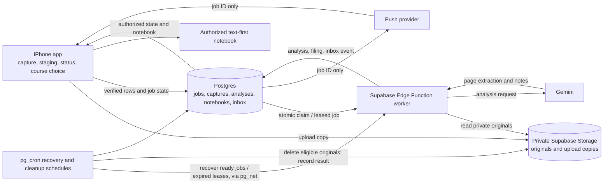
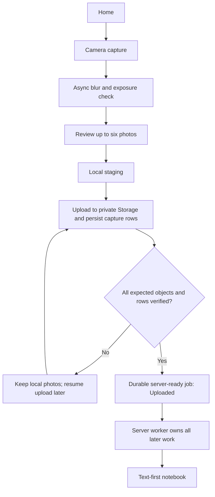
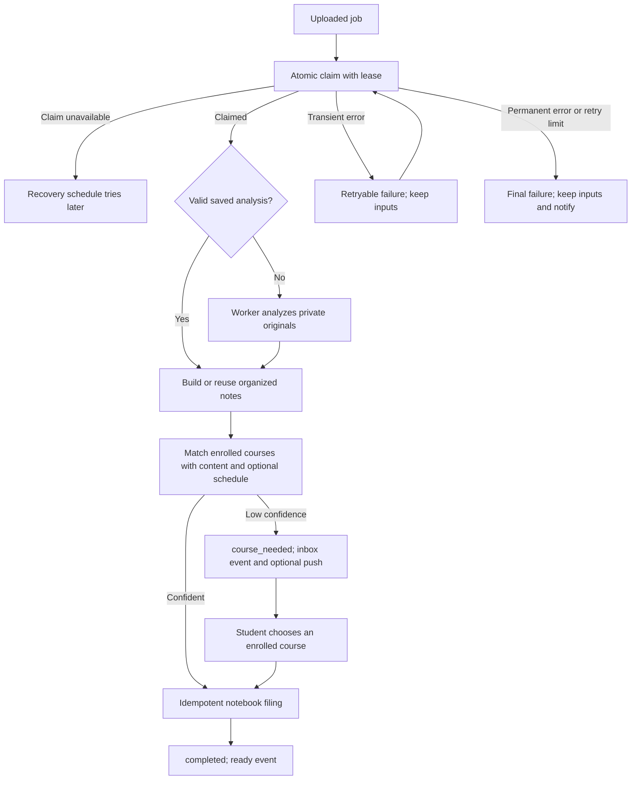
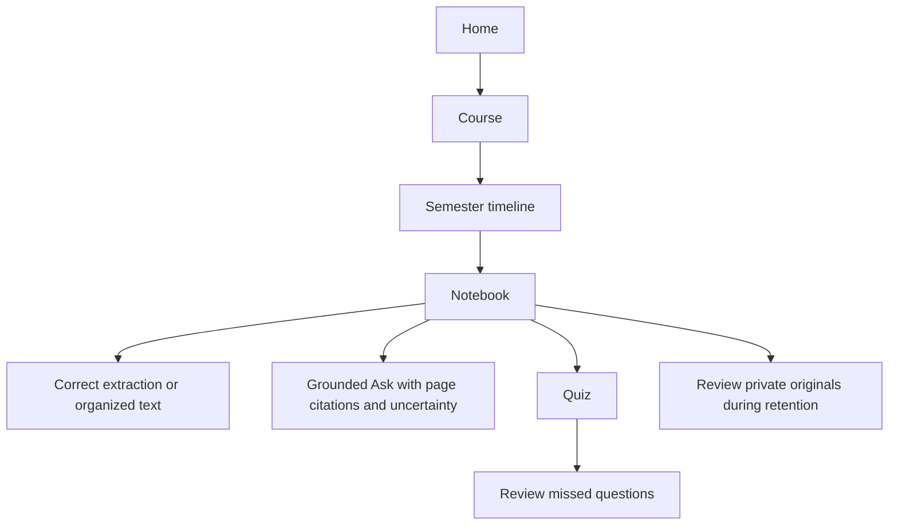
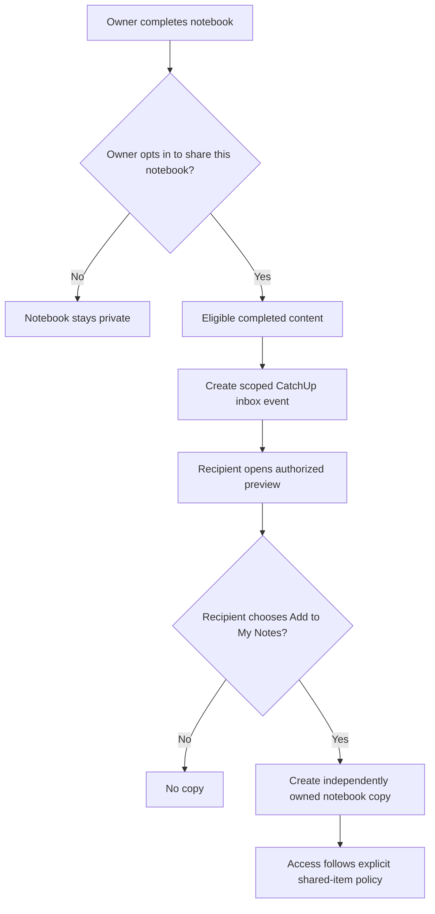
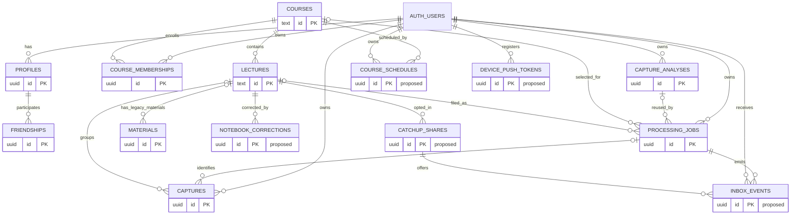

# ClassLens — Implementation Plan

**Status as of this revision:** Session A (migration reconciliation) is complete and recorded in
`docs/CLASSLENS_MIGRATION_STATUS.md`. Session B (claim/lease schema) has not started. This file
is the single authoritative plan — supersedes any earlier copy of
`docs/CLASSLENS_IMPLEMENTATION_PLAN.md` in this repo.

**Source of truth for live implementation:** the current repository and the linked Supabase
project's actual schema/deployments (`yeneypkyvdfpdtspswha`), not this document. Where this
document and the live repo/database disagree, the repo and database win — re-verify rather than
trust a stale paragraph here.

---

## 1. Product vision

ClassLens helps a student capture class material quickly and turn it into an accurate, organized,
searchable notebook:

1. Capture up to six photos without interrupting the camera flow. Run blur and exposure checks
   asynchronously on-device and let the student retake a poor image or keep it.
2. Stage original photos locally. Create a separate compressed upload copy, tuned to retain small
   handwriting, equations, and diagrams. Keep local originals until the complete upload contract
   is verified.
3. Upload to private Supabase Storage and persist capture metadata. "Uploaded" means every
   expected object and capture row is confirmed and a durable server-ready job exists. If the app
   closes before that point, resume upload later. Do not promise iOS force-quit upload completion.
4. After Uploaded, a server worker claims the job, reuses valid saved analysis, extracts faithful
   content per page, creates organized notes, matches only enrolled courses using content signals
   and optional schedule, and files exactly one notebook. The phone displays authorized server
   state and accepts manual course selection; it does not run post-upload AI or filing.
5. Present a text-first notebook: course and date; ordered faithful extraction and unclear
   passages with source-page references; separately labeled AI summary, concepts, examples,
   assignments, and exam mentions; and student corrections.
6. Keep originals private and reviewable for seven days after successful processing. A scheduled,
   idempotent cleanup then removes cloud originals. The app removes temporary phone copies only
   after confirming the server deleted cloud originals, including on a later launch after offline
   use. Failed, unfinished, and review-needed inputs are not automatically deleted. After deletion,
   image-based reanalysis is unavailable.

Retain notebook text, faithful extraction, corrections, page references, analysis metadata, and job
outcome/audit metadata in Postgres. Track cleanup eligibility, attempts, completion time, and last
safe error. Confirm object absence before marking cleanup complete; retry partial failures. Image
cleanup does not remove the notebook. User-requested notebook deletion is a separate, explicit
action from the seven-day image cleanup — define its cascade separately and never let one silently
trigger the other.

The rest of the product includes onboarding/auth polish; a semester course timeline; grounded Ask
with page references and explicit uncertainty; quizzes and missed-question review; PDF import;
audio recording/import with timestamped transcript; video with audio transcript and selected
visual frames; and owner-opt-in CatchUp sharing of completed notebook content. Friendship or shared
enrollment alone never grants access. Set size/duration limits, cost measurement, and retention for
each format as part of its own milestone, before implementation — see §7.

**Do not assume the Supabase Free plan retains a semester of originals.** This project is
confirmed on free tier (see §6). Measure real image sizes, database growth, AI requests/tokens,
and upload/download bandwidth as the pilot runs; document when to upgrade or reduce retention.

## 2. Screens and journeys

- Onboarding, sign-up, sign-in, profile, and course enrollment.
- Home with courses, recent notebooks, durable processing status, inbox notices, and recovery
  actions.
- Camera capture, photo quality feedback, session review, and upload progress.
- Processing status, retry/review state, and course resolution for low-confidence matches.
- Course catalog, course detail, optional schedule setup, and semester timeline.
- Text-first notebook, original-photo review while retained, and correction editor.
- Ask, quiz, and missed-question review.
- PDF import; audio recording/import and transcript review; video import, transcript, and
  selected-frame review.
- CatchUp inbox, scoped read-only preview, and explicit Add to My Notes action.
- Settings for notification permission, privacy, retention, and account actions.

## 3. Architecture

The server owns every step after the upload contract reaches Uploaded. Push is a hint only; the
app fetches current authorized state using the job ID.



**Execution model, made concrete (not left as a diagram box):** Supabase Edge Functions are
request-triggered, not long-running daemons. `pg_cron` is enabled by default on every Supabase
project including free tier, so the recovery/cleanup schedules run as `pg_cron` jobs that use
`pg_net` to `POST` into the worker Edge Function on a fixed interval, picking up ready jobs and
expired leases. Confirm current Edge Function execution-time limits before assuming a full
claim → analyze → file cycle fits in one invocation; if a multi-page Gemini call risks exceeding
it, the worker renews its own lease partway through rather than hoping the call finishes first.

**Claim/lease as one atomic statement.** No separate SELECT-then-UPDATE (races):

```sql
UPDATE processing_jobs
SET status = 'analyzing', worker_run_id = $1, lease_expires_at = now() + interval '$2 seconds'
WHERE id = $3
  AND status = 'uploaded'
  AND (lease_expires_at IS NULL OR lease_expires_at < now())
RETURNING *;
```

Every later worker write to that job includes `AND worker_run_id = $current_run_id`, so a stale
runner (lease expired, job reclaimed) fails to commit instead of silently overwriting a newer
attempt.

**RLS vs. service role.** The worker's Supabase client uses the service-role key, which bypasses
RLS entirely — RLS on `processing_jobs`, `captures`, etc. protects the phone client, not the
worker. The worker's own safety comes from always scoping queries by `owner_id`/`job_id`
explicitly in SQL, and from never exposing the service-role key to the client bundle.

**Idempotent filing.** A unique constraint on `(owner_id, job_id)` or `(owner_id, session_id)` in
the notebook-linking table enforces "repeated filing returns the same notebook" at the database
level, not only in application logic.

**Push payload stays minimal.** Push carries only the job ID; the app fetches authorized current
state on open. A denied push permission never blocks correctness, only speed of notice.

### App flows

**Capture and upload:**


**Processing, retry, and course-needed:**


**Study:**


**CatchUp:**


## 4. Data model and retention inventory

This ERD reflects what §5 (migration status) confirms is actually live, plus proposed entities not
yet built. Not runnable SQL — verify column names against the live schema before writing new
migrations.



| Entity | Status and purpose | Ownership/RLS | Retention | Milestone |
|---|---|---|---|---|
| auth.users | Existing Supabase Auth identity | Managed by Supabase Auth | Follow account deletion policy | Existing/auth |
| profiles | Existing public profile fields | Authenticated profile reads; owner writes | Retain until account deletion | Existing/auth |
| friendships | Existing pending/accepted relationships | Only pair can read; requester creates; addressee accepts | Retain until account deletion unless policy changes | Existing/CatchUp prerequisite |
| courses | Existing course catalog | Existing policies; preserve catalog rows | Retain; never delete to remove enrollment | Existing/enrollment |
| lectures | Existing notebook records and AI fields | Owner-aware access; verify live policies | Retain text/metadata after photo deletion | Existing/notebook |
| materials | Existing legacy attachment records | Legacy/demo policies differ from authenticated capture access | Preserve existing legacy rows | Compatibility |
| course_memberships | Existing per-user enrollment | User-scoped RLS | Retain while enrolled | Existing |
| captures | Existing page metadata and session grouping; job/lecture links | Owner-scoped RLS; verify live deployment | Keep metadata; never delete failed/unfinished inputs | Existing/retention |
| capture_analyses | Existing structured per-session analysis | Owner-scoped RLS | Retain text after originals deleted | Existing |
| processing_jobs | Existing durable job state; **confirmed live, migration history bookkeeping needs repair — see §5** | Owner-scoped RLS; worker needs narrowly scoped privileged access | Retain outcome/audit metadata | Existing; server conversion in progress |
| Storage objects | Existing private lecture-materials bucket and capture paths | Existing policies; verify authenticated and worker access live | 7 days after successful processing, then scheduled deletion | Retention |
| Local staged files | App-owned device copies plus local job metadata | Device-local, tied to signed-in owner and job | Keep through 7-day review window; longer for failed/unfinished/review-needed | Capture/retention |
| course_schedules | Proposed optional schedule signals | User-owned RLS; never expose another user's schedule | Until user removes schedule/course | Schedule |
| inbox_events | Proposed durable ready/course-needed/final-failure/CatchUp events | Recipient-only reads; server-only creation | Bounded history; set exact duration at implementation | Worker/notifications |
| device_push_tokens | Proposed per-device token registry | User registers/removes own; server-only delivery access | Remove on logout, invalid token, or unregister | Notifications |
| notebook_corrections | Proposed student corrections with page references | Notebook owner only | Retain with notebook | Notebook |
| catchup_shares | Proposed per-notebook owner opt-in and scoped access | Owner controls; recipient accesses only opted-in item | Expire/revoke; recipient copies follow own retention | CatchUp |
| usage and cleanup metadata | Proposed aggregate cost/deletion metrics | Server-only writes; no photo contents or prompts in telemetry | Bounded operational retention | Cost/retention |

## 5. Migration status (Session A finding)

Full detail lives in `docs/CLASSLENS_MIGRATION_STATUS.md`. Summary for this plan:

- All 15 committed local migrations' schema effects are **live** and match the repo, modulo two
  cosmetic function-body drifts (`accept_demo_friendship`, `claim_captures_for_analysis` — comments
  missing from the live body, logic identical).
- The remote's `supabase_migrations.schema_migrations` bookkeeping table only recognizes **9 of
  15** as applied. The six unrecorded ones — `20260915030000_demo_profile_access` through
  `20260921000000_durable_processing_jobs`, including `processing_jobs` itself — are live but
  untracked.
- **Blocking risk:** a `db push` today would likely error re-running several of those six
  (non-idempotent `CREATE TABLE`/`CREATE POLICY` statements). Do not push until this is repaired.
- **Fix, not yet run:** `supabase migration repair --status applied <version>` for each of the six,
  then confirm `supabase db diff --linked` comes back clean. This is a remote-state change and
  needs explicit go-ahead each time it's run, per the deployment-order rule in §8.
- Unrelated: an uncommitted, in-progress edit to `20260914010000_allow_demo_reads.sql` currently
  has a typo (`grant selec`) that would break that file if committed as-is. Not fixed as part of
  reconciliation — flagged for whoever owns that change.

## 6. Operating constraints (confirmed)

- **Supabase tier: Free.** `pg_cron` is enabled by default at this tier, so the recovery/cleanup
  schedule design in §3 needs no upgrade. Two things to watch, not yet mitigated:
  - **Free projects pause after 7 days of inactivity.** A `pg_cron` job firing every few minutes
    should itself count as activity and prevent this — confirm live once the schedule exists;
    don't assume it.
  - **500 MB database / 1 GB file storage caps.** The 7-day original-photo retention window (§9,
    milestone 4) will approach these caps faster than "measure as we go" implies. Do a rough
    estimate (per-photo size × expected pilot volume × 7 days) before the retention window goes
    live, not after storage starts erroring.
- Milestones 3 (server worker) and 6 (schedules/timeline) can run as **parallel, independent
  tracks** — milestone 6 doesn't touch the worker, processing jobs, or Storage.

## 7. Processing state and safety contract

The database currently has `queued`, `uploading`, `analyzing`, `course_needed`, `filing`,
`completed`, `retryable_failed`, `terminal_failed`. This plan adds an explicit server-ready
`uploaded` boundary and a review-needed hold where needed; additions/renames require an additive
migration and compatibility review.

- **Upload completion:** every expected object exists in the private bucket; every expected
  capture row is readable and matches owner, job, session, page order, and count; durable job
  state is marked server-ready. Until then, retain all local originals and allow upload resume.
  Remove only disposable upload staging copies, and only once confirmed.
- **Claim and lease:** one atomic server claim per job (§3); lease expiry and runner token on every
  state-changing operation; renew lease during long work; reject stale-runner writes. A `pg_cron`
  recovery schedule reclaims ready jobs and expired leases.
- **Analysis reuse:** validate owner, session, ordered capture IDs, and analysis schema. Reuse a
  valid saved analysis after retries or lost responses; never issue duplicate paid analysis.
- **Exactly-once filing:** transactional and idempotent, keyed on owner plus job/session identity.
  Repeated filing returns the same notebook and never duplicates page links.
- **Retry and review:** bound automatic retries. Separate retryable errors from terminal failure
  and review-needed state. Keep originals and metadata for all unresolved states. Student course
  choice resumes server processing using saved analysis.
- **Notification:** durable inbox event from server state. Push contains only job ID. On open,
  fetch authorized current job/event; push permission denial never hides results.
- **Cleanup eligibility:** only completed, successfully filed jobs become eligible 7 days after
  completion. Failed, unfinished, course-needed, and review-needed jobs are excluded. A scheduled
  worker deletes each cloud original idempotently, verifies absence, records attempts/results,
  retries partial failure. A device cleanup task and foreground/launch sweep remove matching
  temporary phone copies only after server deletion is confirmed — device cleanup is best-effort
  while the app isn't running, so the UI must never promise force-quit cleanup timing. Keep
  notebook text, extraction, correction, page references, analysis, and job audit.
- **Deletion disclosure:** explain that deleting originals removes image-based reanalysis and
  visual review. Define user-requested notebook/account deletion and its cascading cleanup
  separately — never silently delete retained text as part of 7-day image cleanup.

## 8. Deployment order

For milestones requiring backend changes: reconcile migration history (§5) → review and deploy the
additive migration with RLS → deploy the compatible worker/Edge Function → configure and test the
recovery schedule → configure push credentials and token registration → enable the 7-day cleanup
schedule only after successful-file eligibility and deletion verification pass. Test each stage
against a non-production project/device first. Never apply migrations, deploy, or alter the remote
project during documentation-only work.

## 9. Implementation milestones and sessions

Dependency order. For each session: automated checks where applicable, live Supabase verification
where applicable, and physical-iPhone scenarios where applicable. Never report a test or deployment
complete without recorded evidence. Each session starts with `git status --short`, confirms branch,
and stops at its own boundary — it does not continue into the next session's work.

| # | Milestone/session | Depends on |
|---|---|---|
| 1 | Auth, baseline, compatibility | — |
| 2 | Rapid capture, quality feedback, staging, upload boundary | 1 |
| **A** | **Migration reconciliation — done, see §5** | 2 |
| B | Claim/lease schema (additive migration + RLS; repair migration history first — see §5) | A |
| C | Worker takes over analysis/matching/filing behind a flag; phone orchestrator stays as fallback | B |
| D | Recovery schedule live (`pg_cron`); phone orchestrator removed; force-quit-after-upload verified | C |
| E | Notebook schema, corrections, cleanup-eligibility columns | D |
| F | Scheduled original-photo cleanup, phone-side sweep | E |
| G | Home recovery UI, inbox events | D |
| H | Push notifications, device token lifecycle | G |
| I | Schedules + semester timeline — **independent track, runs in parallel with B–H** | 1 |
| J | Grounded Ask | E |
| K | Quizzes, missed-question review | J |
| — | **Pilot checkpoint: 4–5 students run capture → notebook → Ask/Quiz** | 1–K, I |
| L | PDF import (limits from pilot data) | pilot |
| M | Audio recording/import | pilot |
| N | Video import | pilot |
| O | Owner-opt-in CatchUp | pilot |
| P | Release, cost, and privacy readiness | ongoing from D; final pass after L–O |

### Session B — Claim/lease schema

- Run `supabase migration repair` for the six unrecognized migrations (bookkeeping only — confirm
  with the project owner before running against remote); confirm `db diff --linked` is clean.
- Additive migration: lease columns on `processing_jobs` (`worker_run_id`, `lease_expires_at`,
  `claimed_at`, `uploaded` status value); RLS confirming owner-only phone access.
- Atomic claim as one SQL statement/function (§3); local test proving concurrent claims can't
  double-claim.
- Do not wire into the real flow yet — phone orchestrator keeps running unchanged.
- **Exit:** migration reviewed and deploy-ready (deploy only if explicitly authorized this
  session); claim-race test passing locally.

### Session C — Worker behind a flag

- Move analysis → course-matching → filing into an Edge Function: atomic claim → reuse-or-run
  analysis → match → idempotent filing → status update, scoped by `owner_id`/`job_id`.
- Gate behind a flag; phone orchestrator stays default until verified.
- Add lease renewal if a real Gemini-call timing measurement shows risk of exceeding Edge Function
  limits.
- **Exit, physical iPhone:** with the flag on, upload → force-quit → worker completes with no
  further phone involvement; evidence recorded.

### Session D — Recovery schedule, orchestrator removal

- `pg_cron` + `pg_net` job invoking the worker Edge Function on interval; reclaims ready jobs and
  expired leases.
- Remove the phone-side orchestrator once the flag-on path is proven.
- **Exit, physical iPhone:** force-quit immediately after Uploaded, don't reopen the app, confirm
  the notebook files anyway — the plan's previously-unverified case.

### Session E — Notebook schema, corrections, cleanup eligibility

- `notebook_corrections` (additive migration, owner-only RLS); cleanup-eligibility columns on
  `processing_jobs`/notebook records (`completed_at`, `cleanup_eligible_at`, `cleanup_attempted_at`,
  `cleanup_completed_at`, `last_cleanup_error`).
- Correction editor UI, page-reference citations resolved from stored text.
- **Exit:** a correction persists across restart with a visible page reference; no cleanup logic
  runs yet.

### Session F — Scheduled cleanup

- `pg_cron` cleanup job: select eligible jobs (completed/filed only, excludes
  failed/course_needed/review-needed), delete Storage objects, verify absence, mark
  complete/record error for retry.
- Phone-side foreground/launch sweep removes local originals only after server confirmation.
- **Exit, physical iPhone:** force eligibility via controlled timestamp, confirm cloud original
  gone, notebook text remains, local copy clears only after server confirmation (test foregrounded
  and after cold relaunch).

### Session G — Home recovery, inbox

- Replace low-contrast repeated completion cards with a compact inbox: one durable `inbox_events`
  row per state transition, server-created only.
- Home reads inbox + current job state, renders recovery action per unresolved item.
- **Exit, physical iPhone:** trigger each event type, confirm one card per transition, readable
  contrast, working recovery action.

### Session H — Push

- `device_push_tokens`; register on grant, remove on logout/invalid token.
- Push payload carries only job ID.
- **Exit, physical iPhone:** allow/deny permission; open an event from foreground, background,
  terminated; Home recovery still works with permission denied.

### Session I — Schedules and semester timeline (parallel track)

- `course_schedules` (user-owned RLS); optional schedule setup UI; matcher treats schedule as a
  signal, never a filter that could select an unenrolled course.
- Semester timeline orders lectures by date without touching the global catalog.
- **Exit:** two accounts with conflicting/no schedules both match correctly; enrollment changes
  never delete catalog rows.

### Session J — Grounded Ask

- Ask answers generated only from stored notebook text (post-cleanup safe), resolved page
  citations, explicit uncertainty when evidence is missing.
- **Exit, physical iPhone:** ask about a cited passage (correct citation) and an absent fact
  (explicit uncertainty, not a fabricated answer).

### Session K — Quizzes, missed-question review

- Quiz generation grounded in saved notebook content only; persist missed questions with source
  citation.
- **Exit:** generate a quiz, answer one incorrectly, confirm it's reviewable later with source
  reference intact.

### Pilot checkpoint

Run the 4–5 student pilot on milestones 1–K + I before starting L–O. Use it to collect real
per-photo-size, storage-growth, and AI-usage numbers (§6) — those numbers drive the size/duration
limits in L–N, not the other way around.

### Session L — PDF import

- Limits from pilot-measured data; page-level citations; corrupt-file/oversize handling with clear
  errors.

### Session M — Audio recording/import

- Duration/byte limits from pilot data; timestamped transcript; citations resolve to timestamps.

### Session N — Video import

- Duration/byte/frame-count limits; audio transcript plus documented, capped frame-selection
  policy; citations resolve to frame/time.

### Session O — Owner-opt-in CatchUp

- `catchup_shares` (owner opt-in, default off, per-notebook, expiring/revocable); read-only scoped
  recipient preview; "Add to My Notes" creates an independently owned copy, not a live link.
- **Exit, two accounts:** confirm no access without opt-in (friendship/shared enrollment alone is
  never enough), then opt-in → preview → copy → revoke and confirm source is blocked afterward.

### Session P — Release, cost, privacy readiness

- Final pass: onboarding/auth polish, contrast/accessibility, loading/empty/error states,
  privacy/deletion disclosure text, and — using real pilot numbers — a documented decision on
  whether free tier holds for a full semester or the project needs to upgrade or shorten retention.

## 10. Cost, limits, and operational decisions

Measure before setting final per-format limits: median and high-percentile file sizes from real
captures; compressed-copy size and legibility; storage growth at 7-day retention; number/duration
of model calls; input/output token or equivalent provider usage; bandwidth; retry rate; cleanup
success. Keep operational metrics free of photo contents and unnecessary prompts. Set alert/review
thresholds based on measured usage and the free-tier caps in §6. If projected semester usage
exceeds available storage or provider limits, shorten original retention with clear disclosure,
reduce supported input sizes, or upgrade — never claim guaranteed $0 pricing.

Set separate limits for photo count/bytes, PDF bytes/pages, audio duration/bytes, and video
duration/bytes/frame count. Each modality session (L–N) documents these values, its model/bandwidth
budget, temporary-file handling, and deletion behavior before implementation.

## 11. Working rules

1. Start each session in the real repo with `git status --short`; never overwrite, stash, or stage
   anyone's work without saying so. Confirm current branch and only touch files relevant to that
   session's milestone.
2. Mark work **verified implemented**, **reported but not independently verified**, or **planned**
   — don't blur these. Quote exact schema/function names only after reading them live.
3. Don't start a whole-repository audit every session. Don't invent tests, live migrations, push
   credentials, or native build results. Keep changes scoped to the session's boundary. Ask before
   deployment, remote SQL, commit, or push unless the current request explicitly authorizes it.
4. If this plan and the repo disagree, the repo wins — update this file to match, don't force the
   repo to match a stale plan.
