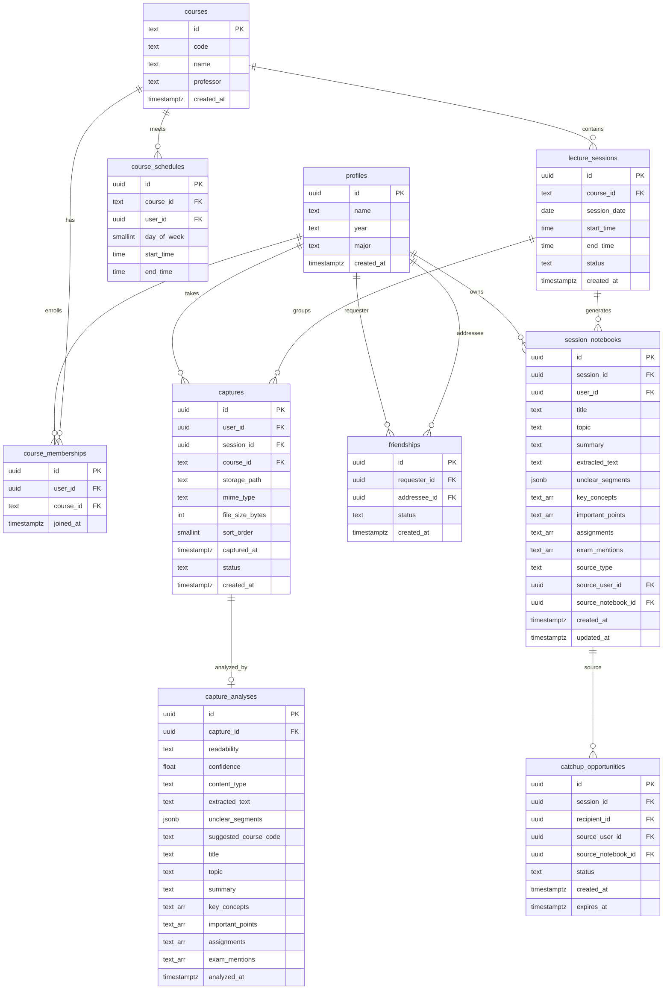

# ClassLens Evolution — Full Implementation Plan (≤20 Users)

> **Authoritative project plan.** Build incrementally for 10–20 users, preserve working behavior, and avoid premature deployment-scale infrastructure. Use `expo-background-task` for background resume work; `expo-background-fetch` is deprecated.

Same vision, same features, and same depth as the original analysis. Every feature ships. No over-engineering for scale we don't have yet.

---

## What This Plan Builds

Everything from the original analysis, with infrastructure sized for reality:

| Feature | Status |
|---|---|
| ✅ Rapid continuous camera capture (instant shutter, camera stays live) | Build it |
| ✅ On-device blur/exposure detection before upload | Build it |
| ✅ Retake / Keep Anyway quality feedback | Build it |
| ✅ Multi-photo capture sessions (up to 6 per session) | Build it |
| ✅ Session grouping (time + schedule + AI signals) | Build it |
| ✅ Course enrollment + schedule awareness | Build it |
| ✅ Evolved `CaptureAnalysis` contract (faithful extraction + organization) | Build it |
| ✅ Improved data model (full ERD, 10 tables) | Build it |
| ✅ Background processing resilience (resume after app close) | Build it |
| ✅ Automatic CatchUp evaluation (pg_cron scheduled job) | Build it |
| ✅ CatchUp push notifications (Expo Notifications) | Build it |
| ✅ CatchUp review + "Add to My Notes" | Build it |
| ✅ Semester notebook view | Build it |
| ✅ Faithful vs. AI layer separation in UI | Build it |
| ✅ Ask This Lecture + Quiz (reconnected to new model) | Build it |

## What We Size Down (Not Remove)

| Original Analysis (100K) | This Plan (≤20 users) |
|---|---|
| Background URLSession (iOS system-level uploads when app is killed) | `expo-background-task` for resume — good enough at 20 users |
| pgBouncer connection pooling | Supabase default pooling is fine |
| CDN for thumbnails | Generate thumbnails, serve from Storage directly |
| pgvector semantic search | PostgreSQL full-text search (revisit at 50+ lectures/user) |
| Tiered Gemini models (Flash + Flash Lite) | Single model: `gemini-3.1-flash-lite` (already deployed) |
| Batch cost optimization (4 photos → 1 call) | Still batch — but for quality, not cost savings |
| Dedicated image compression pipeline | Client-side quality 0.8 + size check before upload |
| Abuse/moderation pipeline | Trust the 20 users |
| Geographic distribution | Single region |
| Rate limiting on Edge Functions | Supabase built-in limits suffice |
| Storage lifecycle (cold storage after 6 months) | Skip — storage cost is negligible at this scale |
| Provider interface abstraction | Direct Gemini calls — swap later if needed |
| Share extension (iOS) | Defer — validate camera habit first, build if needed |
| react-native-vision-camera frame processors for blur | Simpler post-capture blur check using `expo-image-manipulator` pixel analysis |

## Hosting & Cost

**You don't deploy anything.** The app talks directly to your existing Supabase project. When a real student installs the app and signs up, they connect to the same Supabase project you already have — no extra server, no DevOps.

| Service | Free Limit | Usage at 5–6 real users | Cost |
|---|---|---|---|
| **Supabase Free** | 500MB DB, 1GB Storage, 500K Edge calls/mo | ~50MB DB, ~200MB photos, ~500 calls/mo | **$0** |
| **Gemini Free tier** | ~1,000–1,500 req/day, 5–15 req/min | ~25 calls/day | **$0** |
| **Expo push notifications** | Free | ~10–20 notifs/day | **$0** |
| **Supabase Pro** | — | Not needed at this scale | **Skip** |

> [!IMPORTANT]
> **Supabase free projects pause after 7 days of inactivity.** During an active semester this won't happen. Over a long holiday break it could. Fix: one `pg_cron` job that runs every 5 days — added in Milestone 1.

> [!NOTE]
> **Gemini 429 rate limit:** If 5 students all tap Analyze at the same second you could hit the 5–15 req/min limit. The existing error handling catches this gracefully. At 5–6 real users in practice, collisions are very unlikely.

**Total cost at 5–6 active users: $0/month.**

---

## A. Complete User Workflows

### Primary Flow: Rapid Capture with Quality Check

```text
Student opens ClassLens
    │
    ▼
Camera is IMMEDIATELY active
(no course selection, no menu, no splash screen)
Viewfinder fills the screen, shutter button at bottom
    │
    ▼
Tap shutter — INSTANT (<50ms)
    │
    ├──▶ Photo saved to local storage
    ├──▶ On-device quality check runs (blur + exposure)
    │       • Laplacian variance for blur detection
    │       • Histogram analysis for exposure
    │       • Pure image math — no ML model, no cloud call
    │
    ├── Quality GOOD:
    │     ✓ animation, thumbnail appears in bottom strip
    │     Camera stays live and ready — no delay
    │
    └── Quality BAD (blurry / too dark / too bright):
          ⚠️ Quick overlay on the thumbnail:
          ┌─────────────────────────────┐
          │ ⚠️ This looks blurry        │
          │ [Retake]  [Keep Anyway]     │
          └─────────────────────────────┘
          • "Retake" discards and reopens shutter
          • "Keep Anyway" adds it with a ⚠️ badge
          • Overlay auto-dismisses after 3s → Keep Anyway
          Camera STAYS LIVE during this overlay
    │
    ▼
Tap shutter again (another photo) — still instant
    │
    ▼
... repeat N times (up to 6 photos per session) ...

Bottom strip always visible:
┌─────────────────────────────────────────┐
│ [📷✓] [📷✓] [📷⚠️] [📷✓]  [+ Add]     │
│  tap to preview / remove any photo      │
└─────────────────────────────────────────┘
    │
    ▼
Tap "Done" (or close camera)
    │
    ▼
Session review screen:
┌─────────────────────────────────────┐
│ 4 LECTURE PAGES                     │
│ [📷] [📷] [📷⚠️] [📷]              │
│  (tap to enlarge, swipe to remove)  │
│                                     │
│ ┌─────────────────────────────────┐ │
│ │ 📍 Looks like CS 3358           │ │
│ │    Data Structures              │ │
│ │    Mon/Wed 10:00–11:20          │ │
│ │    [Change course]              │ │
│ └─────────────────────────────────┘ │
│                                     │
│ [Continue to analysis →]            │
│ [Add more photos]                   │
│ [Retake photo 3 ⚠️]                │
└─────────────────────────────────────┘
    │
    ▼
Upload + Analyze (foreground, with background resilience)
    │
    ▼
Processing screen shows:
  "Uploading photo 2/4…"
  "Reading your lecture…"
  "Finding where this belongs…"
  "Building your notebook…"
    │
    ├── IF app stays open: completes normally
    │
    └── IF app is closed / backgrounded:
          Captures already uploaded are safe in Supabase.
          On next open, processing screen resumes from
          where it left off (checks capture statuses).
          No duplicate uploads, no duplicate analysis.
    │
    ▼
Course confirmation (if ambiguous)
    │
    ▼
Lecture notebook opens
```

### Secondary Flow: Review Semester Notebook

```text
Student opens ClassLens → Home
    │
    ▼
Home screen shows courses + recent sessions
┌─────────────────────────────────────┐
│ CS 3358 · Data Structures           │
│ 3 sessions this month               │
│                                     │
│ MATH 2471 · Calculus III            │
│ 2 sessions this month               │
└─────────────────────────────────────┘
    │
    ▼
Tap CS 3358
    │
    ▼
Course view: semester timeline of lecture sessions
┌─────────────────────────────────────┐
│ Sept 15 · Binary Search Trees       │
│ 4 captures · Ready                  │
│                                     │
│ Sept 13 · Linked Lists              │
│ 2 captures · Ready                  │
│                                     │
│ Sept 10 · Arrays and Pointers       │
│ 3 captures · Ready                  │
└─────────────────────────────────────┘
    │
    ▼
Tap September 15 session
    │
    ▼
Lecture notebook:
┌─────────────────────────────────────┐
│ 🖼️ ORIGINAL MATERIAL               │
│ [photo 1] [photo 2] [photo 3] [4]  │
│                                     │
│ 📝 FAITHFUL EXTRACTION              │
│ "What was actually readable"        │
│ ⚠️ "Section in top-right was        │
│     unreadable due to glare"        │
│                                     │
│ 🧠 AI STUDY NOTES                   │
│ Summary: ...                        │
│ Key Concepts: ...                   │
│ Important Points: ...               │
│ Assignments: ...                    │
│ Exam Mentions: ...                  │
│                                     │
│ [💬 Ask This Lecture]               │
│ [📝 Generate Quiz]                  │
└─────────────────────────────────────┘
```

### CatchUp Flow

```text
After class ends + 40 min grace period:

Supabase scheduled function evaluates:
  Rejan has 0 captures for CS 3358 Sept 15 session
  Prashant has 4 captures for CS 3358 Sept 15 session
  They are accepted friends + both enrolled in CS 3358
    │
    ▼
Create catchup_opportunity row
Send push notification to Rejan:
"CS 3358 notes available from today's lecture.
 Prashant captured 4 pages."
    │
    ▼
Rejan opens ClassLens → CatchUp tab
    │
    ▼
CatchUp screen:
┌─────────────────────────────────────┐
│ 🤝 MISSED CLASS?                    │
│                                     │
│ CS 3358 · Sept 15                   │
│ From: Prashant Bhattarai            │
│ 4 captures · Binary Search Trees    │
│                                     │
│ [View Notes]                        │
└─────────────────────────────────────┘
    │
    ▼
CatchUp review (read-only):
  - Prashant's original captures
  - Faithful extraction
  - AI-organized notebook
  - [➕ Add to My Notes]
    │
    ▼
"Add to My Notes" creates Rejan's own copy:
  - Own session_notebook (independent text)
  - Read-only reference to Prashant's captures
  - Credits: "via Prashant"
  - Rejan can now Ask/Quiz on this lecture
```

---

## B. Evolved Data Model — Full ERD

### Entity-Relationship Diagram



### Table Descriptions

| Table | Purpose | Migration From Current |
|---|---|---|
| `profiles` | User identity (unchanged) | Already exists |
| `courses` | Course catalog (keep existing, add enrollment) | Already exists — no rename needed |
| `course_memberships` | User ↔ course enrollment | **New** — enables schedule-based classification |
| `course_schedules` | When a course meets (per user) | **New** — critical for session grouping |
| `lecture_sessions` | A physical class meeting event | **New** — groups multiple captures into one session |
| `captures` | Individual photos with lifecycle status | **Evolves** from existing `materials` table |
| `capture_analyses` | AI analysis per capture (or per session batch) | **New** — keeps AI output separate from capture metadata |
| `session_notebooks` | Aggregated study material for user+session | **Evolves** from existing `lectures` table |
| `friendships` | Social connections (unchanged) | Already exists |
| `catchup_opportunities` | Missed-class sharing evaluations | **New** — created by scheduled evaluation |

### What Changes From Current Schema

| Current | Evolved | Why |
|---|---|---|
| `materials` (upload + attach) | `captures` (lifecycle + session grouping) | Clearer: captures have status, session, user, sort order |
| `lectures` (= notebook) | `session_notebooks` (study material) + `lecture_sessions` (physical event) | Separate the meeting from the notes — enables CatchUp copies |
| No schedule awareness | `course_schedules` | Enables auto-suggest on capture |
| No enrollment | `course_memberships` | Enables "enrolled users" for CatchUp evaluation |
| No analysis persistence | `capture_analyses` | Keeps faithful extraction separate from organized notes |

### Capture Status Flow

```text
local ──▶ uploading ──▶ uploaded ──▶ analyzing ──▶ analyzed ──▶ grouped
  │           │             │            │             │
  │           ▼             ▼            ▼             ▼
  └──────── (retry on failure) ◄──── failed
```

At ≤20 users this is synchronous — the UI drives each transition. No background queue needed.

---

## C. Evolved AI Analysis Contract

### Current: `LectureAnalysis`

```ts
type LectureAnalysis = {
  suggestedCourse: string | null;
  title: string;
  topic: string;
  summary: string;
  keyConcepts: string[];
  importantPoints: string[];
  assignments: string[];
  examMentions: string[];
};
```

### Evolved: `CaptureAnalysis`

```ts
type CaptureAnalysis = {
  // How readable was the source material?
  readability: 'good' | 'partial' | 'unreadable';
  confidence: number; // 0.0–1.0

  // What kind of classroom material is this?
  contentType: 'whiteboard' | 'slide' | 'handwritten' | 'worksheet'
             | 'diagram' | 'textbook' | 'other';

  // What was ACTUALLY readable — separated from AI interpretation
  faithfulExtraction: {
    text: string;
    unclearSegments: Array<{
      description: string;
      reason: string; // "glare", "blurry", "cut off", "handwriting"
    }>;
  };

  // Course identification hints (labels, not IDs)
  courseSignals: {
    suggestedCode: string | null;  // "CS 3358"
    suggestedName: string | null;  // "Data Structures"
    subjectArea: string | null;    // "Computer Science"
  };

  // AI-organized study material
  organization: {
    title: string;
    topic: string;
    summary: string;
    keyConcepts: string[];
    importantPoints: string[];
    assignments: string[];
    examMentions: string[];
  };
};
```

### Why the Evolution Matters

1. **`faithfulExtraction`** — The killer differentiator. Students see what was actually read vs. what AI organized. When the model says "I couldn't read the top-right due to glare," trust is built.

2. **`contentType`** — Whiteboard needs different handling than printed slides. The notebook UI can adapt.

3. **`courseSignals`** — Separate code/name/subjectArea gives the session grouping logic more signal. The model might see "CS 3358" on a slide AND recognize "Data Structures" from the content.

4. **`readability` + `confidence`** — When confidence is low, prompt the student instead of silently producing bad output.

### Multi-Photo Batch Analysis

When a session has multiple photos, they ALL go in one Gemini call. The model sees the full whiteboard sequence and produces ONE `CaptureAnalysis` for the session. This is better than analyzing each photo separately:

```text
[photo_1] + [photo_2] + [photo_3] + [photo_4]
                    │
                    ▼
            ONE Gemini call
                    │
                    ▼
        ONE CaptureAnalysis for the session
        (better context = better analysis)
```

---

## D. System Architecture

### Capture + Analysis Pipeline

```text
┌──────────────────────────────────────────────────────────────┐
│ MOBILE DEVICE                                                │
│                                                              │
│  Camera (instant) ──▶ Local preview strip                    │
│  [snap] [snap] [snap] [done]                                 │
│              │                                               │
│              ▼                                               │
│     Course suggestion                                        │
│     (check schedule for current day/time)                    │
│              │                                               │
│              ▼                                               │
│     Sequential upload (foreground)                           │
│     photo 1/4… 2/4… 3/4… 4/4…                              │
│              │                                               │
└──────────────┼───────────────────────────────────────────────┘
               │
               ▼
┌──────────────────────────────────────────────────────────────┐
│ SUPABASE                                                     │
│                                                              │
│  Storage ◄── photo uploads                                   │
│     │                                                        │
│     ▼                                                        │
│  captures table ◄── metadata inserts (status: uploaded)      │
│     │                                                        │
│     ▼                                                        │
│  Edge Function: analyze-captures (NEW)                       │
│     │                                                        │
│     ├──▶ Fetch all photos for this session                   │
│     ├──▶ Send ALL photos in ONE Gemini call                  │
│     │      • readability assessment                          │
│     │      • faithful text extraction                        │
│     │      • content understanding                           │
│     │      • course/topic signals                            │
│     │                                                        │
│     ▼                                                        │
│  capture_analyses table ◄── analysis result                  │
│  captures.status = analyzed                                  │
│     │                                                        │
│     ▼                                                        │
│  Session Grouping Logic (in processing screen)               │
│     • captured_at within schedule window?                    │
│     • user enrolled in matching course?                      │
│     • AI courseSignals match?                                │
│     │                                                        │
│     ▼                                                        │
│  lecture_sessions table (create or match)                     │
│  session_notebooks table (create)                            │
│     │                                                        │
│     ▼                                                        │
│  Navigate to lecture notebook                                │
│                                                              │
└──────────────────────────────────────────────────────────────┘
```

### CatchUp Evaluation Pipeline

```text
┌────────────────────────────────────────────────┐
│ SUPABASE pg_cron or Edge Function cron         │
│ Runs every 15 minutes                          │
│                                                │
│ For each lecture_session that ended             │
│ > 40 minutes ago AND has no opportunity yet:    │
│                                                │
│   For each enrolled user in that course:        │
│     IF captures for this session = 0            │
│     AND user has accepted friends               │
│     AND friend is enrolled in same course       │
│     AND friend has a READY notebook             │
│     THEN:                                       │
│       INSERT catchup_opportunity                │
│       (push notification deferred — in-app     │
│        badge for now at ≤20 users)             │
│                                                │
│ DO NOT TRIGGER IF:                              │
│   - Recipient has any capture (any status)      │
│   - No friend has a ready notebook              │
│   - Opportunity already exists                  │
│   - Session is older than 48 hours              │
│                                                │
└────────────────────────────────────────────────┘
```

> [!NOTE]
> At ≤20 users, the CatchUp evaluation can be a simple Edge Function called on a pg_cron schedule OR triggered when a notebook is saved. Push notifications are deferred — use in-app polling/badge on the CatchUp tab. Add Expo push notifications when validated.

### "Add to My Notes" Flow

```text
Rejan taps "Add to My Notes"
    │
    ▼
Create new session_notebook:
  - source_type = 'catchup'
  - source_user_id = Prashant's ID
  - source_notebook_id = Prashant's notebook ID
  - COPY all text fields (title, summary, concepts, etc.)
  - user_id = Rejan's ID
  - session_id = same session
    │
    ▼
Photo access: read-only through session-scoped RLS
  - Rejan can VIEW Prashant's captures for this session
  - No physical copy of photos (save storage)
  - If Prashant deletes account, Rejan keeps text but loses photos
    │
    ▼
Rejan now has an independent notebook
  - Can Ask This Lecture on it
  - Can Generate Quiz on it
  - Text is independent — Rejan could annotate/edit later
  - Credits: "via Prashant Bhattarai"
```

---

## E. Proposed Changes — File by File

### New Database Migrations

#### [NEW] Migration: `evolve_schema.sql`

Creates the new tables and evolves existing ones:

```sql
-- 1. Course memberships (who is enrolled where)
CREATE TABLE course_memberships (
  id uuid DEFAULT gen_random_uuid() PRIMARY KEY,
  user_id uuid NOT NULL REFERENCES auth.users(id),
  course_id text NOT NULL REFERENCES courses(id),
  joined_at timestamptz DEFAULT now(),
  UNIQUE (user_id, course_id)
);

-- 2. Course schedules (when does each course meet, per user)
CREATE TABLE course_schedules (
  id uuid DEFAULT gen_random_uuid() PRIMARY KEY,
  course_id text NOT NULL REFERENCES courses(id),
  user_id uuid NOT NULL REFERENCES auth.users(id),
  day_of_week smallint NOT NULL CHECK (day_of_week BETWEEN 0 AND 6),
  start_time time NOT NULL,
  end_time time NOT NULL,
  UNIQUE (course_id, user_id, day_of_week)
);

-- 3. Lecture sessions (a physical class meeting)
CREATE TABLE lecture_sessions (
  id uuid DEFAULT gen_random_uuid() PRIMARY KEY,
  course_id text NOT NULL REFERENCES courses(id),
  session_date date NOT NULL,
  start_time time,
  end_time time,
  status text NOT NULL DEFAULT 'active'
    CHECK (status IN ('active', 'ready', 'archived')),
  created_at timestamptz DEFAULT now(),
  UNIQUE (course_id, session_date)
);

-- 4. Captures (evolves from materials — individual photos with lifecycle)
CREATE TABLE captures (
  id uuid DEFAULT gen_random_uuid() PRIMARY KEY,
  user_id uuid NOT NULL REFERENCES auth.users(id),
  session_id uuid REFERENCES lecture_sessions(id),
  course_id text REFERENCES courses(id),
  storage_path text NOT NULL,
  mime_type text NOT NULL,
  file_size_bytes int,
  sort_order smallint NOT NULL DEFAULT 0,
  captured_at timestamptz DEFAULT now(),
  status text NOT NULL DEFAULT 'uploaded'
    CHECK (status IN ('uploaded', 'analyzing', 'analyzed', 'grouped', 'failed')),
  created_at timestamptz DEFAULT now()
);

-- 5. Capture analyses (AI output, separate from capture metadata)
CREATE TABLE capture_analyses (
  id uuid DEFAULT gen_random_uuid() PRIMARY KEY,
  session_id uuid REFERENCES lecture_sessions(id),
  readability text NOT NULL CHECK (readability IN ('good', 'partial', 'unreadable')),
  confidence real NOT NULL CHECK (confidence BETWEEN 0 AND 1),
  content_type text,
  extracted_text text,
  unclear_segments jsonb DEFAULT '[]',
  suggested_course_code text,
  suggested_course_name text,
  subject_area text,
  title text NOT NULL,
  topic text NOT NULL,
  summary text NOT NULL,
  key_concepts text[] DEFAULT '{}',
  important_points text[] DEFAULT '{}',
  assignments text[] DEFAULT '{}',
  exam_mentions text[] DEFAULT '{}',
  analyzed_at timestamptz DEFAULT now()
);

-- 6. Session notebooks (aggregated study material per user per session)
CREATE TABLE session_notebooks (
  id uuid DEFAULT gen_random_uuid() PRIMARY KEY,
  session_id uuid NOT NULL REFERENCES lecture_sessions(id),
  user_id uuid NOT NULL REFERENCES auth.users(id),
  title text NOT NULL,
  topic text,
  summary text,
  extracted_text text,
  unclear_segments jsonb DEFAULT '[]',
  key_concepts text[] DEFAULT '{}',
  important_points text[] DEFAULT '{}',
  assignments text[] DEFAULT '{}',
  exam_mentions text[] DEFAULT '{}',
  source_type text NOT NULL DEFAULT 'capture'
    CHECK (source_type IN ('capture', 'catchup')),
  source_user_id uuid REFERENCES auth.users(id),
  source_notebook_id uuid REFERENCES session_notebooks(id),
  created_at timestamptz DEFAULT now(),
  updated_at timestamptz DEFAULT now(),
  UNIQUE (session_id, user_id, source_type)
);

-- 7. CatchUp opportunities
CREATE TABLE catchup_opportunities (
  id uuid DEFAULT gen_random_uuid() PRIMARY KEY,
  session_id uuid NOT NULL REFERENCES lecture_sessions(id),
  recipient_id uuid NOT NULL REFERENCES auth.users(id),
  source_user_id uuid NOT NULL REFERENCES auth.users(id),
  source_notebook_id uuid NOT NULL REFERENCES session_notebooks(id),
  status text NOT NULL DEFAULT 'pending'
    CHECK (status IN ('pending', 'viewed', 'added', 'dismissed', 'expired')),
  created_at timestamptz DEFAULT now(),
  expires_at timestamptz DEFAULT (now() + interval '7 days'),
  UNIQUE (session_id, recipient_id, source_user_id)
);

-- RLS on all new tables
ALTER TABLE course_memberships ENABLE ROW LEVEL SECURITY;
ALTER TABLE course_schedules ENABLE ROW LEVEL SECURITY;
ALTER TABLE lecture_sessions ENABLE ROW LEVEL SECURITY;
ALTER TABLE captures ENABLE ROW LEVEL SECURITY;
ALTER TABLE capture_analyses ENABLE ROW LEVEL SECURITY;
ALTER TABLE session_notebooks ENABLE ROW LEVEL SECURITY;
ALTER TABLE catchup_opportunities ENABLE ROW LEVEL SECURITY;

-- Users manage their own enrollments and schedules
CREATE POLICY "own_memberships" ON course_memberships
  FOR ALL USING (auth.uid() = user_id);
CREATE POLICY "own_schedules" ON course_schedules
  FOR ALL USING (auth.uid() = user_id);

-- Users see their own captures + friends' captures through sessions
CREATE POLICY "own_captures" ON captures
  FOR ALL USING (auth.uid() = user_id);

-- Notebooks: own + catchup-sourced
CREATE POLICY "own_notebooks" ON session_notebooks
  FOR ALL USING (auth.uid() = user_id);

-- CatchUp: recipient can read, source user's data visible
CREATE POLICY "own_opportunities" ON catchup_opportunities
  FOR ALL USING (auth.uid() = recipient_id);

-- Sessions: readable by enrolled users
CREATE POLICY "enrolled_sessions" ON lecture_sessions
  FOR SELECT USING (
    EXISTS (
      SELECT 1 FROM course_memberships
      WHERE course_memberships.course_id = lecture_sessions.course_id
      AND course_memberships.user_id = auth.uid()
    )
  );
CREATE POLICY "create_sessions" ON lecture_sessions
  FOR INSERT WITH CHECK (
    EXISTS (
      SELECT 1 FROM course_memberships
      WHERE course_memberships.course_id = lecture_sessions.course_id
      AND course_memberships.user_id = auth.uid()
    )
  );

-- Analyses: readable by session participants
CREATE POLICY "read_analyses" ON capture_analyses
  FOR SELECT USING (true);
CREATE POLICY "insert_analyses" ON capture_analyses
  FOR INSERT WITH CHECK (true);

-- Indexes for the queries we'll run
CREATE INDEX captures_user_session ON captures(user_id, session_id);
CREATE INDEX captures_user_date ON captures(user_id, captured_at);
CREATE INDEX memberships_user ON course_memberships(user_id);
CREATE INDEX memberships_course ON course_memberships(course_id);
CREATE INDEX sessions_course_date ON lecture_sessions(course_id, session_date);
CREATE INDEX notebooks_session_user ON session_notebooks(session_id, user_id);
CREATE INDEX opportunities_recipient ON catchup_opportunities(recipient_id, status);
```

> [!IMPORTANT]
> The existing `materials` and `lectures` tables stay for backward compatibility with the current demo. New captures go through the new `captures` table. The migration is **additive** — nothing breaks.

---

### New / Modified Services

#### [NEW] [schedule.ts](file:///Users/admin/Desktop/classLens/src/services/schedule.ts)
```ts
getMySchedule(): Promise<CourseSchedule[]>
setSchedule(courseId: string, slots: ScheduleSlot[]): Promise<void>
suggestCourseForNow(): Promise<Course | null>
// Checks current day + time against user's enrolled course schedules
```

#### [NEW] [enrollment.ts](file:///Users/admin/Desktop/classLens/src/services/enrollment.ts)
```ts
getMyEnrollments(): Promise<CourseEnrollment[]>
enrollInCourse(courseId: string): Promise<void>
unenrollFromCourse(courseId: string): Promise<void>
```

#### [NEW] [captures.ts](file:///Users/admin/Desktop/classLens/src/services/captures.ts)
```ts
uploadCapture(input: CaptureUploadInput): Promise<Capture>
uploadCaptures(inputs: CaptureUploadInput[]): Promise<Capture[]>
getSessionCaptures(sessionId: string): Promise<Capture[]>
getCaptureUrl(capture: Capture): Promise<string | null>
```

#### [NEW] [sessions.ts](file:///Users/admin/Desktop/classLens/src/services/sessions.ts)
```ts
createSession(courseId: string, date: string): Promise<LectureSession>
getOrCreateSession(courseId: string, date: string): Promise<LectureSession>
getCourseSessions(courseId: string): Promise<LectureSession[]>
```

#### [NEW] [notebooks.ts](file:///Users/admin/Desktop/classLens/src/services/notebooks.ts)
```ts
createNotebook(input: CreateNotebookInput): Promise<SessionNotebook>
getNotebook(sessionId: string): Promise<SessionNotebook | null>
getUserNotebooks(courseId?: string): Promise<SessionNotebook[]>
```

#### [NEW] [catchup.ts](file:///Users/admin/Desktop/classLens/src/services/catchup.ts)
```ts
getMyOpportunities(): Promise<CatchUpOpportunity[]>
viewOpportunity(id: string): Promise<void>
addToMyNotes(opportunityId: string): Promise<SessionNotebook>
dismissOpportunity(id: string): Promise<void>
```

#### [MODIFY] [ai.ts](file:///Users/admin/Desktop/classLens/src/services/ai.ts)
```ts
// NEW: batch analysis for multi-photo sessions
analyzeCaptures(captures: Capture[]): Promise<CaptureAnalysis>
// KEEP: existing single-material analysis for backward compat
analyzeMaterial(material: Material): Promise<LectureAnalysis>
// KEEP: Ask + Quiz reconnected to session notebooks
askNotebook(notebookId: string, question: string): Promise<AskLectureResult>
generateNotebookQuiz(notebookId: string): Promise<GenerateQuizResult>
```

---

### New / Modified Edge Functions

#### [NEW] `analyze-captures` Edge Function
- Accepts `{ captureIds: string[] }` (array of capture UUIDs)
- Fetches ALL photos for those captures from Storage
- Sends them ALL in one Gemini multimodal call
- Returns full `CaptureAnalysis` with faithful extraction + organization
- Uses existing `_shared/ai.ts` utilities (`loadPhoto`, `base64`, `requestGemini`)

#### [NEW] `evaluate-catchup` Edge Function
- Called by pg_cron every 15 minutes (or manually for testing)
- Queries sessions ended > 40 min ago with no existing opportunity
- For each: checks enrollment, captures, friendships, notebooks
- Creates `catchup_opportunity` rows

#### [KEEP] `analyze-material` — backward compatibility for existing demo
#### [KEEP] `ask-lecture` — reconnect to session notebooks
#### [KEEP] `generate-quiz` — reconnect to session notebooks

---

### New / Modified Screens

#### [MODIFY] [capture.tsx](file:///Users/admin/Desktop/classLens/src/app/capture.tsx)
**Major evolution:**
- Camera opens immediately — no intro card on first load
- Multi-photo session: bottom thumbnail strip shows captured photos
- "+" button to add more (up to 6)
- After capture: calls `suggestCourseForNow()` to pre-fill course
- "Done" → passes all photo URIs to processing

#### [MODIFY] [processing.tsx](file:///Users/admin/Desktop/classLens/src/app/processing.tsx)
**Major evolution:**
- Uploads all photos sequentially with progress
- Calls `analyze-captures` with all capture IDs (ONE Gemini call)
- Uses `CaptureAnalysis.courseSignals` + schedule match for course suggestion
- Creates `lecture_session` + `session_notebook` instead of old `lecture`
- Attaches all captures to the session
- Navigates to evolved notebook view

#### [NEW] Schedule setup screen
- Accessible from courses or profile
- For each enrolled course: pick days + start/end time
- Simple time picker UI

#### [NEW] Enrollment screen (or integrate into courses)
- "Join" button on course cards
- Enrolled courses show schedule badge

#### [MODIFY] Lecture/notebook detail screen
- **3-layer display:** Original Material → Faithful Extraction → AI Study Notes
- Scrollable photo gallery for originals
- Faithful extraction card with "unreadable" callouts
- AI study notes with existing summary/concepts/points layout
- Ask + Quiz buttons wired to notebook

#### [MODIFY] [catchup.tsx](file:///Users/admin/Desktop/classLens/src/app/catchup.tsx)
- Replace hardcoded demo with real `catchup_opportunities` query
- Show pending opportunities with friend name, course, capture count
- "View" → read-only notebook with friend's captures
- "Add to My Notes" → creates own notebook copy

#### [MODIFY] Course detail screen
- Show semester timeline of sessions instead of flat lecture list
- Each session card: date, capture count, status, topic

---

### New Types

#### [NEW] [types/captures.ts](file:///Users/admin/Desktop/classLens/src/types/captures.ts)
```ts
export type Capture = {
  id: string;
  userId: string;
  sessionId: string | null;
  courseId: string | null;
  storagePath: string;
  mimeType: string;
  fileSizeBytes: number | null;
  sortOrder: number;
  capturedAt: string;
  status: 'uploaded' | 'analyzing' | 'analyzed' | 'grouped' | 'failed';
};

export type CaptureUploadInput = {
  uri: string;
  mimeType: string;
  fileName: string;
};
```

#### [NEW] [types/analysis.ts](file:///Users/admin/Desktop/classLens/src/types/analysis.ts)
```ts
export type CaptureAnalysis = {
  readability: 'good' | 'partial' | 'unreadable';
  confidence: number;
  contentType: string;
  faithfulExtraction: {
    text: string;
    unclearSegments: Array<{ description: string; reason: string }>;
  };
  courseSignals: {
    suggestedCode: string | null;
    suggestedName: string | null;
    subjectArea: string | null;
  };
  organization: {
    title: string;
    topic: string;
    summary: string;
    keyConcepts: string[];
    importantPoints: string[];
    assignments: string[];
    examMentions: string[];
  };
};
```

#### [NEW] [types/sessions.ts](file:///Users/admin/Desktop/classLens/src/types/sessions.ts)
```ts
export type LectureSession = {
  id: string;
  courseId: string;
  sessionDate: string;
  startTime: string | null;
  endTime: string | null;
  status: 'active' | 'ready' | 'archived';
};

export type SessionNotebook = {
  id: string;
  sessionId: string;
  userId: string;
  title: string;
  topic: string | null;
  summary: string | null;
  extractedText: string | null;
  unclearSegments: Array<{ description: string; reason: string }>;
  keyConcepts: string[];
  importantPoints: string[];
  assignments: string[];
  examMentions: string[];
  sourceType: 'capture' | 'catchup';
  sourceUserId: string | null;
  sourceNotebookId: string | null;
};

export type CatchUpOpportunity = {
  id: string;
  sessionId: string;
  recipientId: string;
  sourceUserId: string;
  sourceNotebookId: string;
  status: 'pending' | 'viewed' | 'added' | 'dismissed' | 'expired';
  expiresAt: string;
};
```

#### [NEW] [types/schedule.ts](file:///Users/admin/Desktop/classLens/src/types/schedule.ts)
```ts
export type CourseSchedule = {
  id: string;
  courseId: string;
  dayOfWeek: number;
  startTime: string;
  endTime: string;
};

export type CourseEnrollment = {
  id: string;
  courseId: string;
  joinedAt: string;
};
```

---

## F. Session Grouping Logic

The heart of the product. When a student finishes capturing, the system determines which session this belongs to:

```text
INPUTS:
  - captured_at timestamp
  - courseSignals from CaptureAnalysis
  - user's enrolled courses + schedules
  - existing lecture_sessions

LOGIC:
  1. Check schedule match (heaviest weight):
     Is captured_at within a known class window?
     (±15 min buffer for before/after class captures)
     → course_id candidate + confidence score

  2. Check enrollment filter:
     Is user enrolled in the candidate course?
     → binary filter

  3. Check AI content signals:
     Does courseSignals.suggestedCode match an enrolled course?
     → confidence boost if matches schedule candidate

  4. Check existing sessions:
     Does a lecture_session already exist for this course + today?
     → if yes, join it (add captures to existing session)

OUTCOMES:
  A. High confidence (schedule + enrollment + AI agree)
     → Auto-assign. Show "Looks like CS 3358" with change option.

  B. Medium confidence (schedule matches but AI is unsure)
     → Show suggestion with "Is this right?" prompt.

  C. Low confidence (no schedule match, or ambiguous)
     → Show course picker. Let student choose.

  D. No courses enrolled
     → Show course creation form (existing flow).
```

At ≤20 users, this logic runs synchronously in the processing screen, not in a background job.

---

## G. Privacy and Sharing Model

```text
┌─────────────────────────────────────────────────────┐
│ CatchUp Sharing requires ALL of:                     │
│                                                     │
│ 1. Accepted friendship (mutual)                     │
│ 2. Both enrolled in the same course                 │
│ 3. Specific lecture_session context                  │
│ 4. Valid catchup_opportunity (not expired/dismissed) │
│ 5. Recipient explicitly chose "Add to My Notes"     │
│                                                     │
│ Friendship does NOT grant:                           │
│ - Browse all friend's courses                       │
│ - Browse all friend's captures                      │
│ - Access to non-shared sessions                     │
│ - Historical access to old sessions                 │
│                                                     │
│ SHARING IS OPT-OUT, NOT OPT-IN:                     │
│ - Captures shared through CatchUp by default        │
│   within accepted friendships + shared enrollment   │
│ - Users can disable CatchUp per course (future)     │
│                                                     │
│ EXPIRATION:                                         │
│ - Opportunities expire after 7 days                 │
│ - Unfriending revokes all CatchUp access            │
│ - Existing notebook copies (text) remain            │
└─────────────────────────────────────────────────────┘
```

---

## H. Implementation Milestones

> [!IMPORTANT]
> Build in order. Each milestone is usable before starting the next.

### Milestone 1: Auth Hardening + Data Model + Core Services (Week 1-2)

**Do the auth prerequisites first — before any real user signs up.**

#### Auth & Email Verification (do this before anything else)

- [ ] **Supabase Dashboard → Auth → Settings: restrict signups to `txstate.edu`**
  - Only real Texas State students can create accounts
  - Prevents random fake-email signups entirely
  - Takes 2 minutes in the dashboard, zero code changes
- [ ] **Keep email confirmation ON** (it is already on — do not disable it)
  - Proves the user owns a real `@txstate.edu` inbox
  - Required for a trusted small network where people connect with classmates they know
- [ ] **Fix [`auth.ts`](file:///Users/admin/Desktop/classLens/src/services/auth.ts) `signUp()` — remove the hackathon-era error (line 78–80):**
  ```ts
  // Remove this throw — it was written for the demo where email confirm was off:
  // if (!data.session) { throw new Error('Account created, but email confirmation is on...') }

  // Replace with: treat no-session as success, let UI show the check-email state
  if (!data.session) return; // email confirmation pending — expected and correct
  ```
- [ ] **Add "Check your email" state to [`signup.tsx`](file:///Users/admin/Desktop/classLens/src/app/signup.tsx):**
  - After `signUp()` returns without error, show:
    > "We sent a confirmation link to your TXST email. Click it to activate your account, then come back and sign in."
  - Simple screen — no navigation, just a message + "Go to sign in" button
  - No new libraries needed
- [ ] **Add keep-alive `pg_cron` job** (prevents free tier pause during breaks):
  ```sql
  SELECT cron.schedule(
    'keep-alive',
    '0 12 */5 * *',  -- noon every 5 days
    $$SELECT 1$$
  );
  ```
  Run this once in the Supabase SQL editor. Done.

#### Data Model

- [ ] Write and apply the `evolve_schema.sql` migration (all new tables)
- [ ] Create `captures.ts` service (upload, read, signed URLs)
- [ ] Create `sessions.ts` service (create/get sessions)
- [ ] Create `notebooks.ts` service (create/get notebooks)
- [ ] Create `enrollment.ts` service (join/leave courses)
- [ ] Update type exports in `src/types/index.ts`
- [ ] Verify: `npx tsc --noEmit` passes, migration applies cleanly

> [!NOTE]
> **Friend search already works.** `searchProfiles(query)` searches by name, excludes your own profile, and never exposes emails. `sendFriendRequest` / `acceptFriendRequest` are fully implemented. The social layer needs no code changes — only the auth gating above.

### Milestone 2: Rapid Camera + Quality Detection (Week 2-3)

The camera experience that makes ClassLens feel different from "upload a photo":

- [ ] Rebuild `capture.tsx` as a **camera-first** screen:
  - Camera viewfinder fills screen immediately on open
  - Shutter button returns instantly (<50ms perceived) — save to local FS, don't block
  - Camera stays live between shots — never closes/reopens
  - Bottom thumbnail strip shows captured photos
- [ ] **On-device blur detection** (post-capture, no cloud):
  - After each capture, run Laplacian variance on a downscaled version
  - Threshold: if variance < cutoff → "blurry"
  - Technology: `expo-image-manipulator` to resize → compute on pixel data
  - Runs async — never blocks the shutter or freezes the camera
- [ ] **On-device exposure check:**
  - Histogram analysis on the downscaled image
  - Flag if > 80% of pixels are in the bottom 10% (too dark) or top 10% (too bright)
- [ ] **Retake / Keep Anyway overlay:**
  - When quality check fails, show inline overlay on the thumbnail (not a modal)
  - Two buttons: "Retake" (discards, shutter ready) and "Keep Anyway" (adds with ⚠️ badge)
  - Auto-dismiss after 3 seconds → defaults to Keep Anyway
  - Camera stays live underneath — never interrupted
- [ ] **Session photo management:**
  - Tap thumbnail to preview full-size
  - Swipe or X to remove a photo from the session
  - "+" button to add more (up to 6)
  - Photos flagged with ⚠️ can be retaken from the review screen
- [ ] Session review screen before processing (with course suggestion)
- [ ] Verify: can rapid-fire 4 photos → see quality feedback → continue to processing

### Milestone 3: Evolved Analysis Pipeline (Week 3-4)

- [ ] Create `analyze-captures` Edge Function (multi-photo → one `CaptureAnalysis`)
- [ ] Full `CaptureAnalysis` contract with faithful extraction + course signals
- [ ] Update `ai.ts` with `analyzeCaptures()` service
- [ ] Create `src/lib/captureAnalysis.ts` parser (validates server + mobile)
- [ ] Verify: 4 photos → one analysis with extraction + organization

### Milestone 4: Session Grouping + Course Schedule (Week 4-5)

- [ ] Create `schedule.ts` service
- [ ] Build schedule setup UI (integrated into course detail)
- [ ] Build enrollment UI ("Join" button on courses)
- [ ] Implement `suggestCourseForNow()` — time + schedule matching
- [ ] Integrate into `processing.tsx`: auto-suggest course, create session, create notebook
- [ ] Verify: capture during CS 3358 window → auto-suggests CS 3358

### Milestone 5: Background Processing Resilience (Week 5)

What happens when the student closes the app during upload/analysis:

- [ ] **Capture status persistence** — each capture has a status in the database:
  - `uploaded` → safe in Supabase Storage + captures table
  - `analyzing` → analysis in progress
  - `analyzed` → analysis saved to capture_analyses
  - `grouped` → assigned to a session + notebook created
- [ ] **Resume-on-open logic:**
  - On app open, check for captures in intermediate states (uploaded but not analyzed, analyzed but not grouped)
  - Show a "You have an unfinished session" banner on Home
  - Tapping it reopens processing from where it stopped
  - No duplicate uploads, no duplicate Gemini calls (check status first)
- [ ] **expo-background-fetch registration:**
  - Register a background task that checks for `uploaded` captures
  - If found, trigger the analysis Edge Function
  - iOS gives ~30s of background execution — enough to start the analysis
  - The Edge Function runs server-side regardless of app state
- [ ] **Resilient processing flow:**
  - Upload each photo immediately as it's captured (not all at "Done")
  - Each upload is independent — if the app closes after photo 3/4, three photos are safe
  - When processing resumes, it skips already-uploaded photos
  - Analysis results are persisted server-side in capture_analyses — survives app close
- [ ] Verify: capture 4 photos → force-close app after upload → reopen → session resumes

### Milestone 6: Semester Notebook View (Week 5-6)

- [ ] Rebuild course detail: semester timeline of sessions
- [ ] Rebuild notebook detail: 3-layer view (originals → extraction → AI notes)
- [ ] Photo gallery for original captures in notebook
- [ ] Faithful extraction display with unclear-segment callouts
- [ ] AI study notes section with existing layout
- [ ] Verify: can navigate Home → CS 3358 → Sept 15 session → full notebook

### Milestone 7: Study Tools Reconnection (Week 6)

- [ ] Port Ask This Lecture to work with `session_notebooks` + `captures`
- [ ] Port Generate Quiz to work with `session_notebooks` + `captures`
- [ ] These already work — reconnect to new data model + multi-photo context
- [ ] Verify: Ask and Quiz produce answers grounded in all session photos

### Milestone 8: Automatic CatchUp + Notifications (Week 7-8)

The complete automatic missed-class experience:

- [ ] **`evaluate-catchup` Edge Function:**
  - Queries `lecture_sessions` that ended > 40 min ago
  - For each: find enrolled users with ZERO captures for that session
  - Check if they have accepted friends who DO have a ready notebook
  - Create `catchup_opportunity` row if all conditions met
  - Prevent duplicates (UNIQUE constraint on session + recipient + source)
- [ ] **pg_cron schedule:**
  - Run `evaluate-catchup` every 15 minutes
  - Configured in Supabase dashboard (Database → Extensions → pg_cron)
  - `SELECT cron.schedule('evaluate-catchup', '*/15 * * * *', $$SELECT ...$$);`
- [ ] **Expo push notifications:**
  - Install `expo-notifications`
  - Register device push token on login, store in `profiles.push_token`
  - `evaluate-catchup` sends push notification via Expo Push API:
    "CS 3358 notes available from today's lecture. Prashant captured 4 pages."
  - Tapping notification opens CatchUp tab
- [ ] **CatchUp tab badge:**
  - Poll for pending opportunities count on app open / tab switch
  - Show numeric badge on CatchUp tab icon
- [ ] Create `catchup.ts` service (getMyOpportunities, addToMyNotes, dismiss)
- [ ] Rebuild `catchup.tsx`: real opportunities, not hardcoded demo
- [ ] Implement "Add to My Notes" (creates independent notebook copy)
- [ ] Read-only view of friend's captures through session-scoped RLS
- [ ] Verify: Prashant captures → 40 min later → Rejan gets notification → opens CatchUp → adds to notes → has own notebook

---

## I. Backward Compatibility

The existing demo flow (materials → lectures → catchup with hardcoded data) stays working throughout:

- Existing `materials` and `lectures` tables remain — no DROP
- Existing Edge Functions (`analyze-material`, `ask-lecture`, `generate-quiz`) keep working
- Old screens continue to function until replaced milestone by milestone
- Demo data (Prashant's assembly lecture) survives the migration

New captures go through the new pipeline; old data stays in old tables.

---

## J. Open Questions

> [!IMPORTANT]
> **Branch strategy:** This spans frontend and backend. On `integration` branch currently. Should we continue on `integration`, or create a dedicated `evolution` branch? The work is incremental and each milestone merges cleanly.

> [!IMPORTANT]
> **Schedule setup friction:** Before any auto-suggestion value, a student must: sign up → create profile → add course → enroll → add schedule. That's a lot of setup. Should M4 include a "schedule-free" mode where the system just pre-selects the most recently used course? (Recommended: yes, schedule matching is a bonus, not a requirement.)

> [!IMPORTANT]
> **Existing `lectures` table:** Should M5 include a one-time migration that converts existing `lectures` rows into `session_notebooks` + `lecture_sessions`? Or keep both systems running side by side? (Recommended: side by side initially, migrate later when the new flow is proven.)

> [!WARNING]
> **Edge Function timeout:** Multi-photo analysis (4-6 photos in one Gemini call) will take longer than single-photo. Supabase Edge Functions have a 150s timeout on paid plans. At 2MB/photo × 6 = 12MB → should be fine within limits. Will verify in M3.

---

## K. Verification Plan

### Per Milestone
- `npx tsc --noEmit` — type-check passes
- `npx expo export` — build succeeds
- Manual test on device for the milestone's feature

### End-to-End (after all milestones)
1. Sign up → create profile → create course → set schedule → enroll
2. Open camera → snap 4 photos → auto-suggests correct course
3. Processing: uploads 4/4 → analyzes → creates session + notebook
4. View notebook: see original photos, faithful extraction, AI notes
5. Ask This Lecture → grounded answer from all 4 photos
6. Generate Quiz → quiz based on all session content
7. Friend misses class → CatchUp opportunity appears → adds to notes
8. Friend's notebook copy is independent, can Ask/Quiz on it

### What Stays Working
- Existing single-photo capture flow
- Existing hardcoded CatchUp demo (until M7 replaces it)
- Existing course/lecture browsing
- Existing quiz/ask features on old lectures
